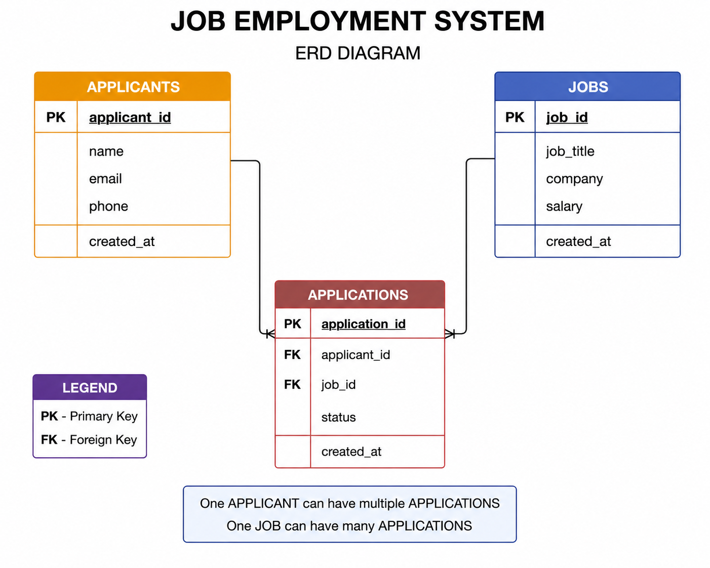
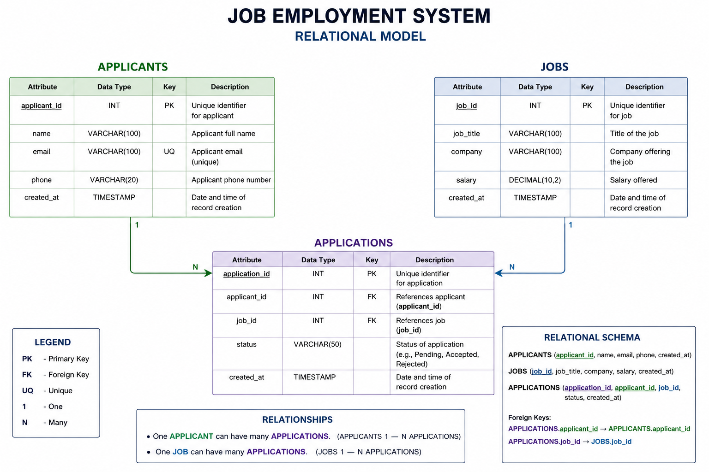

# INTRODUCTION

### BACKGROUND
    Organizations often find themselves buried under a mountain of spreadsheets, scattered emails, and fragmented candidate data due to the growing numbers of Job applicants. Because of this, the Job Employment System was made not just to serve business to get organized and prevent losing promising candidates, but also to make job applications easy for applicants. With this web based application built with Python and MySQL, a business can easily track every applicant in an organized manner. This will turn the messy and confusing piles of applications to a smooth and organized system that will surely save time and make sure that every applicant will not be missed out.

### PROBLEM STATEMENT
    A lot of businesses struggle with hiring because of unorganized emails and confusing spreadsheets to manage job seekers. Due to this inefficient approach, businesses tend to respond late, get confused, or even lose the resumes submitted. Without having an efficient tool in hiring job seekers, promising job seekers often become frustrated and decide to go elsewhere because the organization is too slow in responding to their applications. The Job Employment System solves this problem by putting all hiring information into one digital home, making it impossible to lose track of the applicants and making the information accessible to ensure that the hiring process will become fast and efficient.

### SCOPE
    The system has basic CRUD (Create, Read, Update, and Delete) operations for managing applicants, jobposts, and application status with precise data and time stamps. The job application was developed using HTML and CSS for user interface and ensures that the data will be reliable by having a direct connection with MySQL database, which is stored in structured relational tables. However, the system is only limited to basic data management and connectivity, it does not yet include file uploads like uploading their resume, and security functions like user authentication or role-based access control.

### TARGET USERS
    The target users include HR staff, hiring managers, recruiters, and small business owners. The HR staff gets to efficiently manage the job applicants and job postings while the hiring manager will easily track the status of the applicant through the system. Also, the system gives recruiters a single home base for all their hiring jobs and allows small business owners to maintain their hiring records without relying on an HR.

# PROBLEM OBJECTIVES

### Primary Objective
    The primary objective of this model is to build a useful job employment application that will support management of numerous applications and the applicants itself with consistent data storage.

### Secondary Objective
    The secondary objectives of this application is to provide a fully functional CRUD operations and reliable database connectivity using MySQL, support basic search and listing functions through filterable views, and maintain database integrity through relational design and foreign key constraints.

# BUSINESS RULES

## Detailed Bussiness Logic
User Authentication: the system routes are publicly accessible, meaning that it does not support user authentication.
Database Connection Settings: The application connects to a local MySQL database using credentials defined in src/db.py

### CRUD Operation Constraints
    - Items such as applicants, jobs and applications can be added, updated or deleted.
    - Applications found in the database can be viewed only.
    - When a main record is deleted, all smaller blocks of information associated with the main record are deleted as well.
    - Valid Applicant & Job ID are required for application updates.
    - If a Job or an Applicant is created, the Primary Key (the unique ID number of a Job or an Applicant) cannot be changed.

### Data Validation Rules:
    - Name, email and phone number should be provided for adding/update of applicants.
    - On adding and editing a job, job title, job company and job salary should be provided.
    - The status of the application should have a proper status such as Pending, Accepted or Rejected.
    - The implementation relies on the InputData that is presented in the form on the Client, with minimal server-side validation.

### Access Control Levels:
    - Today there are no access control levels in the system.

## Constraints
    - Application should have been built with Python 3 and use MySQL with mysql-connector-python.
    - Database connectivity requires a local MySQL server (XAMPP or other server).
    - Before running the application, the database schema has to be imported.
    - This application is not meant to be used for high volume production.

## Conditions
    - The MySQL service should be running prior to running the Flask application.
    - The database needs to be created, and should contain the tables necessary.
    - The user should visit app at: http://localhost:5000.
    - Dependencies must be installed after activation of the virtual environment and before the installation to ensure consistent behavior.

# Project Diagrams

    - `applicants`: stores applicant personal details.
    - `jobs`: stores available job listings.
    - `applications`: links applicants and jobs with an application status.

    - `applicants`: (`applicant_id`, `name`, `email`, `phone`, `created_at`)
    - `jobs`: (`job_id`, `job_title`, `company`, `salary`)
    - `applications`: (`application_id`, `applicant_id`, `job_id`, `status`, `created_at`)

# Project Overview

### Architechture and Design Pattern
The application follows a simplified MVC-inspired structure:
- Model: MySQL database schema and `src/db.py` connection logic.
- View: HTML templates in `src/templates` provide user interface pages.
- Controller: `src/routes.py` handles incoming requests, interacts with the database, and returns rendered pages.

### Key Components
- `src/app.py`: Initializes the Flask application and registers routes.
- `src/routes.py`: Defines the main application routes and CRUD operations.
- `src/db.py`: Establishes the MySQL connection.
- `src/templates/`: Contains HTML views for applicants, jobs, applications, and the home page.
- `src/static/`: Stores CSS styles for the user interface.
- `database/schema.sql`: Defines the database schema.
- `database/initial_data.sql`: Supplies sample data.

# Setup Instructions

### Prerequisites
- Python 3.6 or higher
- MySQL server (XAMPP recommended for Windows)
- Git
- pip (Python package installer)
- Web browser (Chrome, Firefox, Edge)

### Installation and Configuration
This section provides the step by step installation and configuration process from scratch.

1. First, we prepare the environment and clone the source by pulling the latest version of the repository and entering the project root.
   git clone https://github.com/your-organization/job-employment-system.git
   cd job-employment-system/job-employment-system

2. Next is we create the virtual environment here using:
   python -m venv venv

3. Next, we activate the environment that have been just created based on operating system and install the packages needed:
   - Windows:
    venv\Scripts\activate

4. Once active, we install this dependency: pip install -r requirements.txt

5.  Moving on, start the MySQL thrpugh XAMPP an ensure it is running. Next, import the schema and sample data.
     mysql -u root < database/schema.sql
     mysql -u root CCCS105 < database/initial_data.sql

6.  Then, we execute the main application script `src/db.py`.

7. In running the application:
   cd src
   python app.py

8. To be able to access the application, open the browser and visit the localhost:
    http://127.0.0.1:5000

# Team Members and Roles
| Team Member               | Role                | Responsibilities                                               |
|---------------------------|---------------------|----------------------------------------------------------------|
| Marc Christan L. Carolino | Project Lead        | Requirements gathering, documentation, and application testing |
|---------------------------|---------------------|----------------------------------------------------------------|
| Laurence I. Echipare      | Backend Developer   | Flask route and database integration implementation            |
|---------------------------|---------------------|----------------------------------------------------------------|
| Laurence I. Echipare      | Database Designer   | Schema design, sample data creation, and database setup        |
|---------------------------|---------------------|----------------------------------------------------------------|
| Lourd Kenneth P. Hugo     | Frontend Developer  | HTML/CSS design and page layout, user interface styling        |
|---------------------------|---------------------|----------------------------------------------------------------|

# Dependencies
Required Python Libraries with Versions
- Flask 3.1.3
- mysql-connector-python

System Requirements
- Operating System: Windows 10/11 or equivalent
- Python: 3.6 or higher
- MySQL: 5.7 or higher
- Browser: Chrome, Firefox, Edge, or Safari
- XAMPP: Recommended for local MySQL server setup

### Running Instructions
1. In starting the application, Open XAMPP control panel and start Apache and MySQL.
2. Next step is open the Visual Studio Code and Open the folder named ‘Job Employment System’. In the homepage, open the terminal and select a new terminal.
3. The next step is to install dependencies through “pip install flask mysql-connector-python.
4. After that, let us set up the database by first opening the browser and going to http://localhost/phpmyadmin and creating a database: CCCS105. Here, we import schema.sql and initial_data.sql.
5. Moving on, go to the src folder (cd src) and run the python file named app.py. The local host will then appear (http://127.0.0.1:5000) and what you need to do is to open it.
6. Meanwhile, in exiting the program, just press the Ctrl + C shortcut in the terminal.

### To use the application’s main features, a short guide is made.

For applicants, you may use the applicant page to manage your information. In here, the system can add new applicants, view all applicants, edit applicant details, and delete applicants.
    - For adding an applicant, open the applicant’s page and fill in the name, email and phone number, then click add. The new applicant will appear in the table.
    - For updating an applicant, click the edit icon beside the selected applicant. Simply modify the information, then click update. The changes will automatically save to the database.
    - For deleting an applicant, just click delete beside the selected record. With this, the applicant’s data will be removed from the system.

As for the Jobs Module, it manages job listings. Here, users can add jobs, edit job details, delete jobs, view all job records.
    - In adding jobs, just enter the job title, company, and salary, then click add. 
    
Then, the application page connects applicants to jobs. Here, users can assign applicants to jobs, update application status, delete applications, and view all submitted applications.
    - For adding an application, just enter applicant ID, Job ID, and Status, then click add. After that, the system will output the status values of the applicant whether accepted or rejected or pending.
